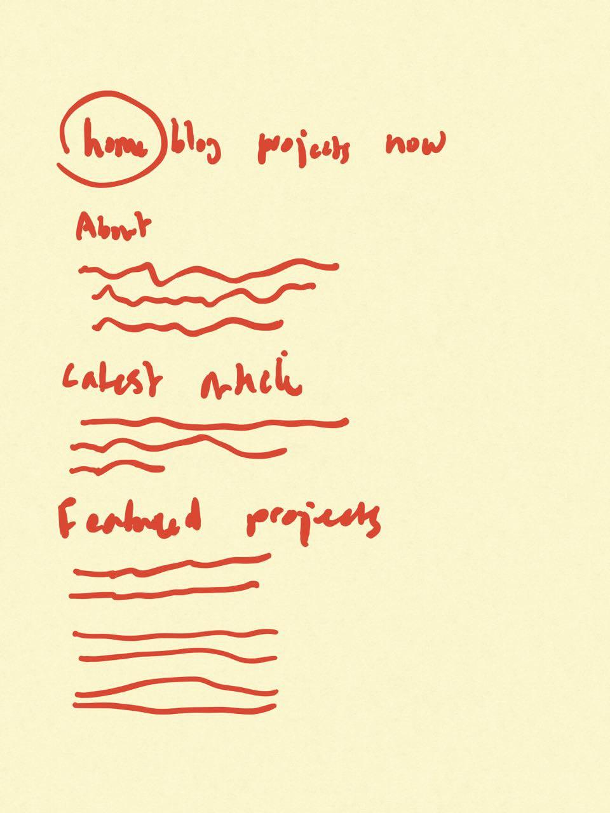

This is a pitch for adding some features to my [personal
website](https://stefthoen.com).

## The problem

I want to share more personal stuff online. Things I'm excited about the
most right now: 

1. A blog about building online products;

2. A ['Now page'](https://nownownow.com/about), where I share the things
   I'm working  on right now;

3. An about page;

4. A list of all the projects I have going on;

I thought of writing about those things on [stef.co](https://stef.co), the
site I'm using for my consultancy business, but I want to keep personal
and business separated.

So I need a new blog. I already got a Gatsby base installed on
[stefthoen.com](https://stefthoen.com) but I need some changes to support
the 3 things mentioned above.

## Appetite

This is a small batch project. I only want to give it one week. It's
somewhat of a prologue and to get a feel for the process.

## Solution

This is the [Gatsby Blog
Starter](https://www.gatsbyjs.org/starters/hagnerd/gatsby-starter-blog-mdx/)
I'm using right now. It's a blog boilerplate with support for `MDX`, which
is form of Markdown that lets you use `JSX` in your Markdown. Since I'm
a developer writing about development, I think it'll come in handy.

The homepage is an index page that shows a small summary of all the blog
posts. Every summary links to the blog post in full.

I want:

1. A new homepage that has an introduction of me, a summary of the last
   blog post with a link to the post, and a list of featured projects I'm
   working on, with a name, a short description and a link to the project.

2. A 'Now' page that shows an unordered list of things I'm focussing on
   right now. 

3. An about page, that is a simple template that holds text and
   a photo.

4. A way for people to start discussions about posts on Twitter. Best
   would probably be to have a link beneath each blog post that not only
   automatically creates a tweet, but also pre-fills it with my handle and
   perhaps the URL to the blog post, or the title as a hashtag. Needs
   research how other people do it.

5. A navigation that has links to __home__, __blog__, __projects__ and
   __now__.

6. Tags for blog posts. I want to make collections of blog posts. I.e. all
   the pitches, all posts related to a project, etc.

7. A products index page based on the blog index page.

8. A single product page based on a blog single page.

9. Write a unique intro for pitches that automatically gets used in all
   pitches.

## Rabit holes

The Twitter comment thing is really not that important. Just a new tweet
with my handle automatically pre-filled would suffice. 

## No Gos

I'm not adding any styling for now and I'm keeping the look of the starter
that I've used as a base. I don't know how I want it to look and am not
capable (yet) to create a design within such a short timespan.
